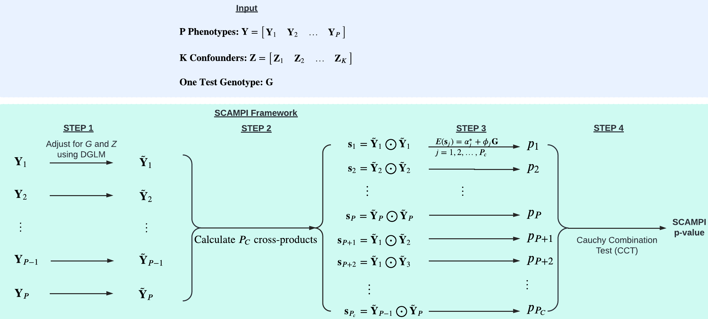

# SCAMPI (Scalable Cauchy Aggregate test using Multiple Phenotypes to test Interactions)

## Description
SCAMPI is developed for screening SNPs with potential interaction effects without requiring the specification of the interacting variables. SCAMPI can be easily scaled to biobank scale dataset.

## SCAMPI Workflow



## Prerequisites
<a href="https://www.r-project.org">R</a> (recommended version >= 4.3.1)

## Installation

```
library(devtools)
devtools::install_github("shijbian/SCAMPI")
```

## Tutorial
<a href="https://rpubs.com/shijbian/SCAMPI_Tutorial">SCAMPI Tutorial</a>

## License
This software is licensed under MIT License.

